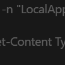

# Tokenizer

**Tokenizer is a Windows desktop app for measuring human token production.**  
**Tokenizer 是一个用于衡量“人类 token 产出”的 Windows 桌面应用。**

In the AI era, we spend a lot of time talking about how many tokens models consume. Tokenizer flips the question:  
**How many tokens can a human actually produce in a day?**

在 AI 时代，我们经常关注模型消耗了多少 token。Tokenizer 关注的是反方向的问题：  
**一个人一天到底能实际产出多少 token？**

Tokenizer does not try to be a cloud analytics dashboard. It is a local-first Windows tool that turns real typing activity into a personal production timeline.  
Tokenizer 不是一个云端统计看板，而是一个本地优先的 Windows 工具。它把真实的键盘输入活动转化成你个人的“产出时间线”。

---

## Why / 为什么做这个项目

Large language models can generate and consume millions of tokens with almost no friction. Humans cannot.  
大语言模型几乎可以无摩擦地生成和消耗数百万 token，但人类做不到。

Human writing is limited by:

- attention
- time
- typing speed
- work context
- fatigue

人类写作受到这些限制：

- 注意力
- 时间
- 打字速度
- 工作场景
- 精力与疲劳

Tokenizer exists to make those limits visible. It helps answer questions like:

- How much text did I actually produce today?
- When was I truly active?
- Which app got most of my output?
- What does my daily production curve look like?

Tokenizer 的意义，就是把这些限制“量化并显示出来”。它帮助你回答这些问题：

- 我今天到底写了多少内容？
- 我真正高效输出的时间段在哪里？
- 哪个应用承载了最多产出？
- 我一天的产出曲线是什么样的？

---

## What Tokenizer Measures / Tokenizer 统计什么

Tokenizer currently tracks **countable visible typing activity** on Windows and turns it into local aggregated statistics.  
Tokenizer 当前统计的是 Windows 上**可计数的可见输入活动**，并把它转成纯本地的聚合统计。

It focuses on:

- typed character volume
- real-time speed
- minute-based storage buckets
- app attribution
- daily summaries
- historical trends

它重点关注：

- 输入字符总量
- 实时输入速度
- 按分钟聚合存储
- 按应用归属统计
- 每日摘要
- 历史趋势

Tokenizer stores **aggregated statistics**, not raw text.  
Tokenizer 保存的是**聚合后的统计数据**，不是原始文本内容。

That means:

- it does **not** store what you typed
- it does **not** keep raw keystroke text history
- it does **not** turn your content into a keylogger archive

这意味着：

- 它**不会**保存你输入了什么文本
- 它**不会**保留逐字逐句的原始键入历史
- 它**不是**一个记录原始内容的键盘记录器

---

## Core Features / 核心功能

### Today / 今日概览

- total typed characters / 今日总字符数
- current minute activity / 当前分钟输入量
- peak minute / 今日峰值分钟
- top app / 今日最高产出应用
- time-bucketed activity chart / 按时间分桶的活动曲线
- app ranking / 应用排行

### History / 历史页

- recent 14-day trend / 最近 14 天趋势
- selected day chart / 指定日期活动图
- selected day app ranking / 指定日期应用排行

### Chart Controls / 图表控制

- time bucket options:
  - `1 min`
  - `15 min`
  - `30 min`
  - `1 hour`
- time range options:
  - `Data only`
  - `0-24 h`

图表支持：

- 时间粒度：
  - `1 分钟`
  - `15 分钟`
  - `30 分钟`
  - `1 小时`
- 时间范围：
  - `仅有数据区间`
  - `全天 0-24 点`

### Floating Ball / 悬浮球

- always-on-top overlay / 置顶悬浮层
- real-time typing indicator / 实时输入速度展示
- draggable docking / 支持拖拽与边缘吸附
- pause / resume / exit actions / 暂停、恢复、退出操作

### System Integration / 系统集成

- tray support / 系统托盘
- autostart option / 开机自启
- launch minimized / 启动时最小化
- local SQLite storage / 本地 SQLite 存储

---

## How It Works / 工作原理

Tokenizer uses a Windows low-level keyboard hook to observe countable input, then sends the activity through a local aggregation pipeline.  
Tokenizer 使用 Windows 低层键盘 Hook 观察可计数输入，再把这些活动送入本地聚合链路。

High-level flow:

1. Capture keyboard activity  
2. Filter non-countable keys  
3. Resolve foreground app  
4. Aggregate into minute buckets  
5. Persist into SQLite  
6. Build charts, rankings, and summaries

整体流程：

1. 捕获键盘活动  
2. 过滤不可计数按键  
3. 识别当前前台应用  
4. 聚合到分钟桶  
5. 写入 SQLite  
6. 生成图表、排行和每日摘要

---

## Project Structure / 项目结构

```text
Tokenizer.sln
├─ Tokenizer.App
│  ├─ Views
│  ├─ ViewModels
│  ├─ Services
│  └─ Diagnostics
├─ Tokenizer.Core
│  ├─ Interfaces
│  ├─ Models
│  └─ Statistics
├─ Tokenizer.Infrastructure
│  ├─ Storage
│  ├─ InputHook
│  ├─ Tray
│  ├─ Windows
│  └─ Autostart
└─ Tokenizer.Tests
```

### `Tokenizer.App`

The WinUI 3 presentation layer.  
WinUI 3 展示层。

Contains:

- pages / 页面
- main shell / 主窗口壳层
- floating ball window / 悬浮球窗口
- view models / 视图模型
- app services / 应用服务

### `Tokenizer.Core`

Framework-agnostic business logic.  
与具体 UI 框架无关的业务逻辑层。

Contains:

- interfaces / 接口
- models / 数据模型
- typing statistics logic / 输入统计逻辑
- bucket aggregation / 时间桶聚合
- visible key classification / 可计数字符判定

### `Tokenizer.Infrastructure`

Persistence and Windows integration layer.  
存储与 Windows 系统能力集成层。

Contains:

- SQLite repositories / SQLite 仓储
- low-level keyboard hook / 低层键盘 Hook
- foreground app detection / 前台应用识别
- tray integration / 托盘集成
- Win32 interop / Win32 互操作
- autostart integration / 开机启动集成

### `Tokenizer.Tests`

Unit and repository tests.  
单元测试与仓储测试。

---

## Tech Stack / 技术栈

- **.NET 8**
- **WinUI 3**
- **Windows App SDK**
- **CommunityToolkit.Mvvm**
- **Microsoft.Extensions.Hosting / DependencyInjection**
- **SQLite** via `Microsoft.Data.Sqlite`
- **LiveChartsCore + SkiaSharpView.WinUI**
- **Win32 / PInvoke**
- **xUnit**

这是一个典型的：

- Windows 原生桌面应用
- MVVM 架构
- 本地数据库驱动
- 本地统计可视化工具

---

## Running Locally / 本地运行

Requirements / 环境要求：

- Windows
- .NET 8 SDK
- Windows App SDK prerequisites

Build and launch / 编译并启动：

```powershell
.\run.ps1 -Launch
```

Build only / 只编译：

```powershell
.\run.ps1
```

Optional flags / 可选参数：

```powershell
.\run.ps1 -SkipTests
.\run.ps1 -SkipRestore
.\run.ps1 -Configuration Release
```

---

## Data and Privacy / 数据与隐私

Tokenizer is designed to be **local-first**.  
Tokenizer 被设计成一个**本地优先**的工具。

Current storage / 当前存储位置：

- SQLite database in `%LOCALAPPDATA%\Tokenizer`
- logs in `%LOCALAPPDATA%\Tokenizer\logs`

What is stored / 会保存的内容：

- aggregated typing statistics
- app attribution
- daily summaries
- app settings

What is not stored / 不会保存的内容：

- raw typed text
- full key-by-key content history

---

## Human Tokens vs Model Tokens / 人类 Token 与模型 Token

Tokenizer uses the word **token** conceptually.  
Tokenizer 对 “token” 这个词的使用，当前更多是一个**概念层面的度量**。

Right now, the app tracks human production through **typed character volume and typing behavior**, not exact tokenizer rules for every model and provider.  
目前它更关注通过**实际输入字符量和输入行为**来衡量人类产出，而不是去精确还原每一家模型提供商的 tokenizer 规则。

That choice is intentional:

- local / 本地
- fast / 快速
- stable / 稳定
- directly tied to human effort / 更接近人的真实付出

You can think of Tokenizer as a **human throughput instrument**:

- model dashboards measure token consumption  
- Tokenizer measures human production

你可以把 Tokenizer 理解成一个**人类产出测量仪**：

- 模型看板衡量的是 token 消耗  
- Tokenizer 衡量的是人类产出

Future versions may add model-specific token estimators.  
未来版本可以继续加入更精确的模型 token 估算模式。

---

## Screenshot / 截图

Floating indicator example / 悬浮球示例：



---

## Current Status / 当前状态

Tokenizer already includes:

- real-time tracking
- local persistence
- charting
- tray integration
- floating overlay
- chart bucketing controls

Tokenizer 当前已经具备：

- 实时输入跟踪
- 本地持久化
- 图表可视化
- 托盘集成
- 悬浮球
- 图表时间分桶控制

It is still evolving, especially around:

- chart interactions
- token estimation models
- documentation polish
- packaging and distribution

它仍在持续迭代，尤其包括：

- 图表交互体验
- token 估算模型
- 文档完善
- 打包与发布

---

## Roadmap Ideas / 后续方向

- exact tokenizer estimation modes for specific LLMs
- export daily summaries
- richer history filtering
- weekly / monthly views
- writing session detection
- app-level productivity comparisons
- configurable counting rules

可以继续扩展的方向包括：

- 针对特定 LLM 的精确 token 估算
- 导出日报
- 更丰富的历史筛选
- 周 / 月视图
- 写作 session 检测
- 应用级生产力对比
- 可配置的计数规则

---

## Philosophy / 项目理念

AI systems can burn through tokens at industrial scale. Humans still create under biological, cognitive, and temporal limits.  
AI 系统可以以工业级规模消耗 token，而人类仍然受到生理、认知和时间的限制。

Tokenizer exists to make those limits visible.  
Tokenizer 的存在，就是为了把这些限制变得可见、可量化、可回看。

If model usage dashboards answer:

> how much compute did we consume?

Tokenizer tries to answer:

> how much did a person actually produce?

如果模型使用看板回答的是：

> 我们消耗了多少算力？

那么 Tokenizer 想回答的是：

> 一个人到底实际产出了多少？

